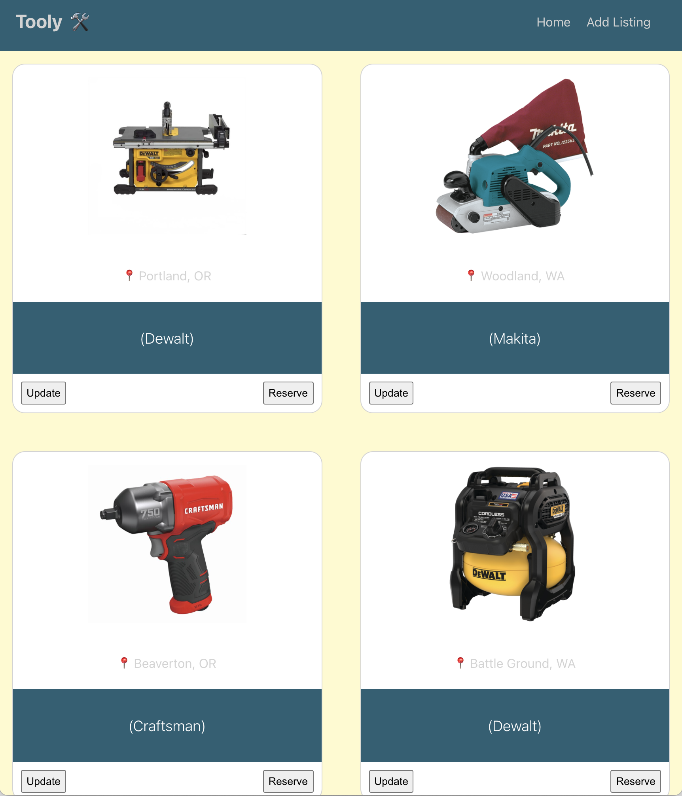
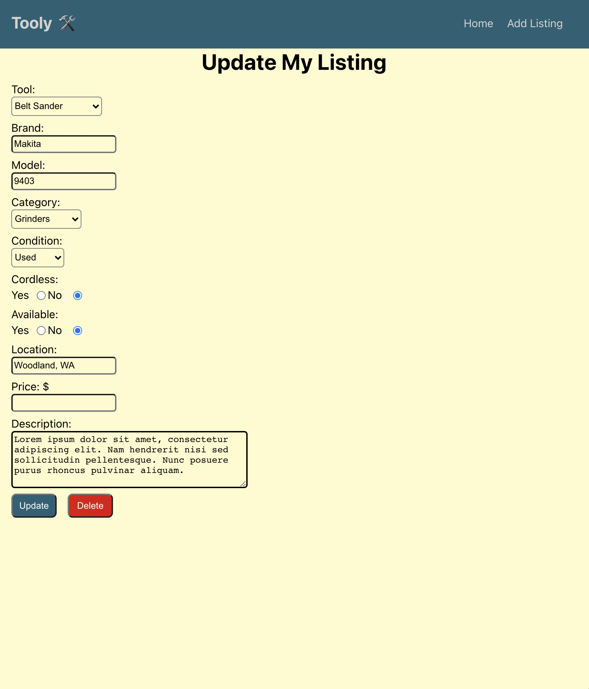

# `Tooly`





## `Description`

Tooly is a peer to peer power tool rental app. Instead of buying a specialty tool you won't frequently use, grab the Tooly app to secure a tool for the time needed and complete your project!

## `User Stories`

### `MVP`

- As a user, I want to be able to post a new power tool for rental, so I can be able to rent my tool.
- As a user, I want to be able to view all power tools available for rental, and see the cost, description, title, so I can make an informed decision.
- As a user, I want to be able to see a detailed view of a listing if clicked on, so I can know more about what I am about to rent.
- As a user, I want to be able to update my listing, so I can make my listing as accurate as possible.
- As a user, I want to be able to delete my listing, so i can remove the posting.
- As a user, I want to be able to reserve the powertool if available so I can use the power tool for my job.

### `Stretch`

- As a user, I want to be able to specify when I want to reserve my listing, so I can have it for when I need it.
- As a user, I want to be able to sort listings by price, filter by category, so I can get to the listing I need as quickly as possible.
- As a user, I want to add images to my listings, so people can see how the tool looks.
- As a user, I want to be able to have my own account, so I can keep track of my listings and power tools I’ve reserved.
- As a user, I want to be able to message the owner of the listing, so we can discuss details of the rental.
- As a user, I want to see the location of the power tool, so I am not traveling far away to rent a tool.
- As a user, I want to be able to accept a rental or not, so I can avoid lower rated users.
- As a user, I want to be able to rate how my experience was renting the tool, so other users can have an idea of the quality of the product.

## `Technologies Used`

- HTML
- CSS
- JavaScript
- React
- React Modern Calendar Date Picker
- Axios
- GitHub
- Netlify
- Visual Studio Code


## `Installation Instructions`

1. Fork and clone project repository
2. Install all dependencies with below terminal command
```
npm install
```
3. cd into repository, then start local server by running the command below. 

```
npm start
```

4. Open project in your code editor of choice. 

## `Contributions`
- Source code: [https://github.com/Squirtle-Squad-1150/Tooly](https://github.com/Squirtle-Squad-1150/Tooly)
- Issue Tracker: [https://github.com/Squirtle-Squad-1150/Tooly/issues](https://github.com/Squirtle-Squad-1150/Tooly/issues)
